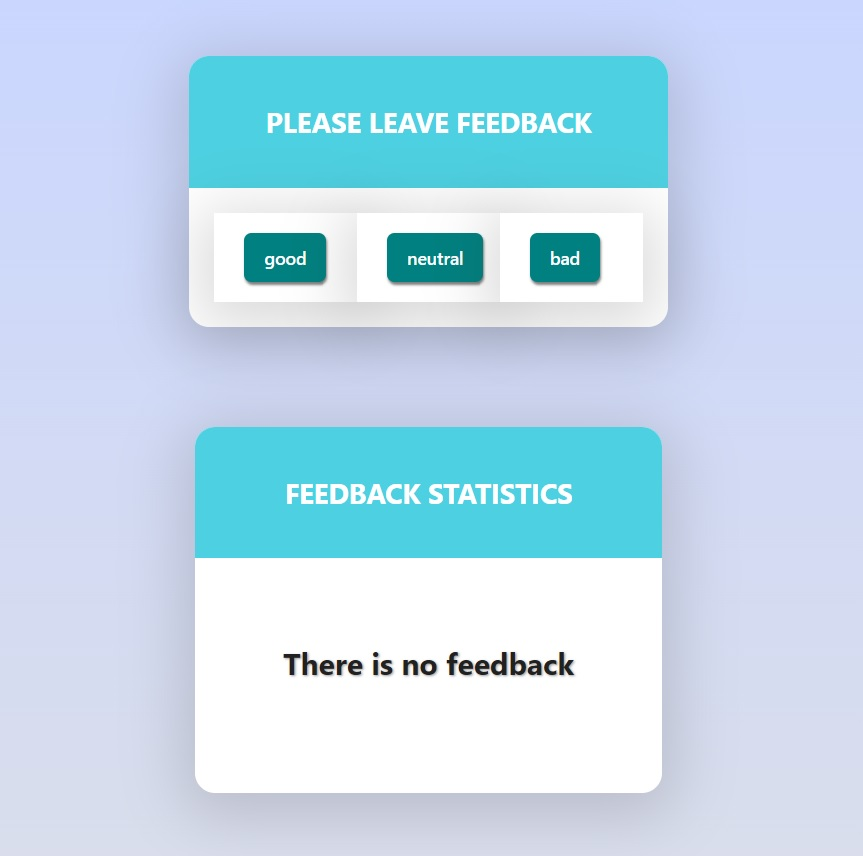
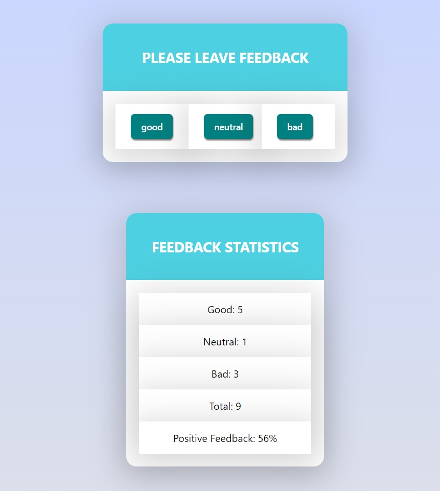

# Feedback App

A simple feedback application built with React.js that allows users to provide
feedback and view statistics.

## Screenshots

 _Feedback App 1_
 _Feedback App 2_

## Features

- Users can leave feedback by selecting one of the available options: "Good,"
  "Neutral," or "Bad."
- The app keeps track of the total feedback received and calculates the
  percentage of positive feedback.
- Feedback statistics are displayed, including the number of "Good," "Neutral,"
  and "Bad" feedback entries, the total number of feedback entries, and the
  percentage of positive feedback.
- If no feedback is provided yet, a notification message is displayed.

## Installation

1. Clone the repository:

```bash
git clone https://github.com/your-username/feedback-app.git
```

2. Navigate to the project directory:

```
cd feedback-app
```

3. Install the dependencies:

```
npm install
```

## Usage

1. Start the application:

```
npm start
```

2. Open your browser and visit http://localhost:3000 to access the Feedback App.

## Contributing

Contributions are welcome! If you find any issues or have suggestions for
improvements, please open an issue or submit a pull request.

## License

This project is licensed under the MIT License. See the [LICENSE](LICENSE) file
for details.

## Acknowledgments

This app was created as a homework assignment for the React module of a coding
at Go IT Courses. Thanks to the creators and contributors of the open-source
libraries used in this project.

## Contact

If you have any questions or suggestions, feel free to contact me at
vadborov@gmail.com.
